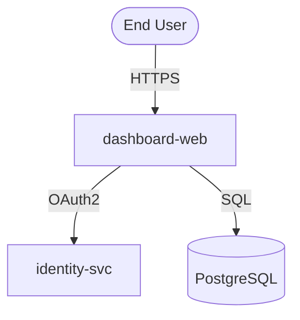

# DFD Threat Modeling (Phase 3.2)

Automated STRIDE threat modeling for Data Flow Diagrams. Paste or upload a
DFD; Tank identifies threats, annotates the diagram with severity colors, and
generates a concrete remediation table.

---

## Getting started

There are two ways to reach the DFD tool:

- **Sidebar** → Pipeline → **DFD Analysis**
- **Ingest page** → scroll to the bottom → *"Have a Data Flow Diagram? Analyze
  it with STRIDE threat modeling →"*

---

## Submitting a diagram

### Mermaid (.mmd)

Paste Mermaid source directly into the textarea, or upload a `.mmd` file.
Tank accepts `graph TD`, `graph LR`, and `flowchart` variants. Example:

### Image (PNG / JPG / WebP)

Upload a diagram image. Tank uses Claude vision to parse the diagram and
construct a Mermaid representation before running STRIDE.

---

## What Tank produces

### Annotated diagram

The original Mermaid source is returned with `style` directives appended that
color-code each threatened node:

| Severity | Color |
| --- | --- |
| Critical | Red `#dc2626` |
| High | Orange `#ea580c` |
| Medium | Amber `#d97706` |
| Low | Blue `#2563eb` |

The diagram is rendered in-browser by `mermaid.js`.

### Threat table

Each identified threat shows:

- **Severity** — Critical / High / Medium / Low (see rubric below)
- **STRIDE category** — Spoofing, Tampering, Repudiation, Information
  Disclosure, Denial of Service, or Elevation of Privilege
- **Element** — the node or edge the threat applies to
- **Description** — 1–2 sentences on what can go wrong
- **Mitigation** — concrete, element-specific remediation step

Threats are sorted Critical → High → Medium → Low.

### Severity rubric

| Severity | Meaning |
| --- | --- |
| **Critical** | Direct RCE, full data exfiltration, or authentication bypass with no prerequisites |
| **High** | Auth bypass or privilege escalation requiring attacker preconditions |
| **Medium** | Data leakage, indirect escalation, or significant functionality disruption |
| **Low** | Defense-in-depth gap, low-likelihood scenario, or informational |

---

## Working with incomplete diagrams

Real DFDs are rarely complete on day one. The **✦ Improve diagram** button
(on any analysis result page) sends your diagram to Tank's knowledge base:

1. Tank runs a semantic search over ingested architecture docs for relevant
   services, trust boundaries, and data flows.
2. Claude receives both the incomplete diagram and the KB context, then
   produces a more complete Mermaid source.
3. A bullet list shows exactly what was added (new nodes, missing data stores,
   unlabeled trust boundaries, etc.).
4. Click **Run STRIDE on improved diagram** to immediately threat-model the
   result, or **Copy Mermaid** to take the improved source elsewhere.

For best results, ingest your architecture docs before using Improve — Tank
draws on whatever is in the KB.

---

## Re-analyzing a diagram

Results are cached by SHA-256 of the input, so re-submitting the same diagram
costs nothing. Use **↺ Re-analyze** on the result page to bypass the cache and
run a fresh STRIDE analysis — useful after:

- Updating the STRIDE prompt (`prompts/dfd_stride.md`)
- Ingesting new architecture docs that change the threat picture
- Modifying the diagram and wanting a clean result rather than the cached one

---

## Exports

From any analysis result page:

| Button | Output |
| --- | --- |
| ↓ PDF | `window.print()` — browser print dialog with sidebar/nav hidden |
| ↓ Mermaid | Annotated `.mmd` source (with color `style` directives) |
| ↓ JSON | Full analysis JSON (`elements`, `threats`, `annotated_mermaid`) |

---

## Caching

Every analysis is stored in the `dfd_analyses` table (keyed by `diagram_hash`,
unique per input). Re-submitting the same diagram or image returns the cached
result instantly at zero API cost. The **↺ Re-analyze** button (or passing
`force=true` to `POST /api/dfd/analyze`) bypasses the cache.

---

## Privacy

DFD text and images follow the same privacy pipeline as all other Tank inputs:

- **Mermaid source**: passed through `apply_redactions` before being sent to
  Claude. Internal hostnames, emails, IPs, and secrets embedded in node labels
  or edge text are replaced with placeholders.
- **Images**: sent to Claude vision after redaction of any extractable text.
  The vision response is also rehydrated before display.
- Results are stored in redacted form; the `redaction_map` is local-only.
