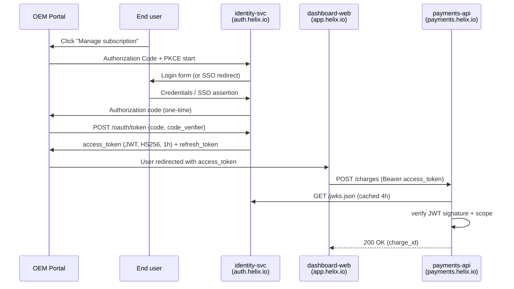

# Auth flow — customer-side OAuth2 + internal service auth

This document is the source for the auth-flow diagram. The
`_gen_fixtures.py` script renders this to `02-auth-flow.png` via the
Mermaid block below; the markdown is also ingested directly so Tank
has the prose context.

## Customer-side flow (B2B OEM portal → Helix)

## Key claims

The access tokens identity-svc issues carry:

- `iss`: `https://auth.helix.io`
- `aud`: list of services the token is good for (e.g.,
  `["payments-api","orders-api"]`)
- `sub`: stable OEM-user UUID
- `customer_id`: the OEM tenant the user belongs to
- `scope`: space-separated scopes; we use a small fixed set
  (`charges:read`, `charges:write`, `devices:read`, `devices:write`,
  `webhooks:configure`)
- `exp`, `iat`, `jti`

Tokens are HS256-signed. The HMAC secret is held in Vault at
`secret/identity-svc/jwt-signing-key/{env}`, rotated quarterly. During
rotation we publish both old and new key IDs in JWKS for a 24-hour
overlap.

## Internal service-to-service auth

Within the prod VPC (`10.50.0.0/16`), services authenticate to each
other via mTLS using certificates issued by our internal CA. Each
EKS pod gets a cert injected by a Vault Agent sidecar; SPIFFE-ish
naming, e.g., `spiffe://helix.internal/svc/payments-api/prod`.

Service-to-service authorization is currently coarse: ingress
NetworkPolicies in EKS define which services can talk to which.
There is no application-level authorization between services
(this is a known gap, would be worth a threat model).

## Customer device authentication

Robotics devices authenticate to device-registry via X.509 client
certificates issued by our internal CA. Cert rotation is quarterly,
automated through a small agent each device runs. Lost or revoked
certs are nuked via OCSP.

## Open questions for the new security hire

(Marcus left these in a Notion page, copied here for context.)

1. Should we move from HS256 to RS256/ES256? Current HMAC-shared-secret
   approach means any service that verifies JWTs has the signing key
   in scope; a compromised payments-api could mint tokens. The CTO
   pushed back on RS256 last year citing token size; worth revisiting.
2. JWKS endpoint isn't behind a rate limiter. It probably should be.
3. Refresh-token rotation is on but token-family revocation isn't
   implemented (RFC 6749 §10.4). Low-frequency edge case.
4. mTLS rotation is reliable but we've never actually run a fire
   drill for "Vault is down, cert expires, what happens?"
