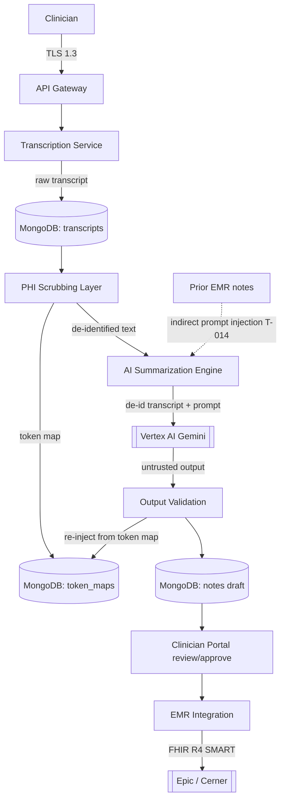

# AI Pipeline DFD (L2) — MedScribe-R-Us

> Owner: AppSec · Status: Draft v1.0
> Data-flow diagram for the de-identification → summarization → validation path.
> Addresses T-007 (scrubbing gap), T-008 (token-map leak), T-014 (indirect prompt injection).

The most security-sensitive flow in the platform: the only place de-identified
PHI leaves MedScribe's control (to Vertex AI), and where LLM output re-enters
the clinical record.

## Trust boundaries
- **B1** Internet → API Gateway (Cloud Armor WAF).
- **B2** MedScribe VPC → Vertex AI (VPC Service Controls perimeter). Only
  de-identified text crosses.
- **B3** MedScribe VPC → Epic/Cerner (SMART on FHIR OAuth, encounter-scoped).

## Key threats on this flow
- **T-007** Scrubbing false-negative → real PHI reaches Vertex AI. Defense:
  layered NER + regex; labeled-corpus validation suite; output PHI-pattern scan.
- **T-008** Wrong token map on re-injection → Patient A's PHI in Patient B's
  note. Defense: HMAC session binding validated before any substitution.
- **T-014** Prior EMR note carries an injection payload into LLM context.
  Defense: delimit prior notes as untrusted data; instruction-pattern anomaly
  detection on output; sanitize prompt-control characters.
